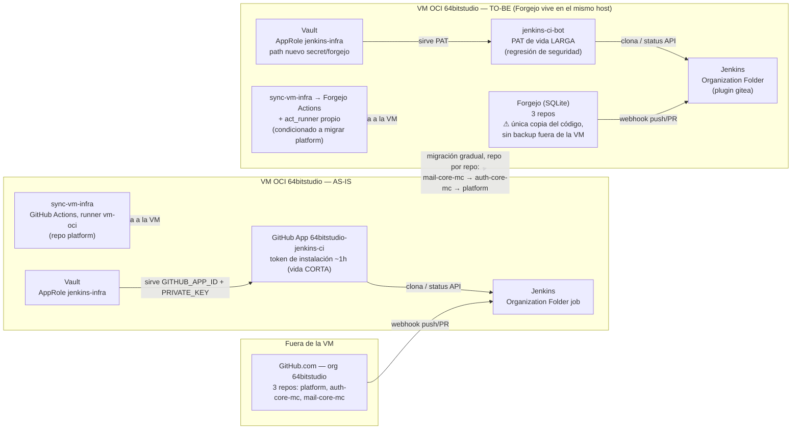
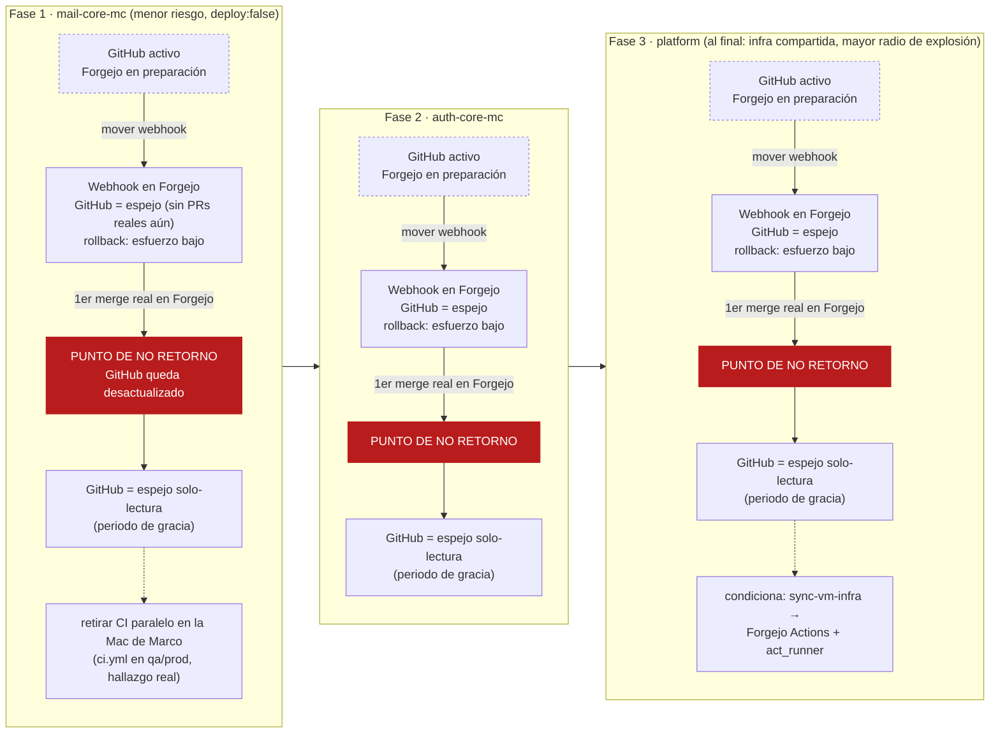

# Definición: Migración de GitHub/GitHub Actions a un servidor de git propio autoalojado (Forgejo)

## Resumen ejecutivo

Se evalúa migrar el hosting de git y CI/CD de los 3 repos de `64bitstudio`
(`platform`, `auth-core-mc`, `mail-core-mc`) de GitHub/GitHub Actions a
**Forgejo**, autoalojado en la misma VM compartida (OCI Ampere A1.Flex,
Always Free) — consistente con la filosofía ya aplicada al resto de la
infra (Jenkins/Traefik/SonarQube/Portainer/Vault) de no depender de
servicios de terceros. El `architect` recomienda Forgejo sobre
Gitea/GitLab CE y una migración gradual repo-por-repo
(`mail-core-mc` → `auth-core-mc` → `platform`) con GitHub como red de
seguridad temporal, pero identifica una **regresión de seguridad real**
(se pierde la identidad de aplicación de vida corta que hoy tiene la
GitHub App) y deja **sin confirmar si la VM tiene margen de recursos
real** para sumar Forgejo. La elicitación de negocio encontró, además,
una migración interna ya en curso pero inconclusa en `mail-core-mc`
(sus ramas `qa`/`prod` siguen corriendo CI real vía GitHub Actions en un
runner activo en la Mac de Marco) que este proyecto debe resolver
explícitamente, no ignorar. Ninguna implementación arranca hasta VoBo
conjunto explícito sobre este documento.

## Objetivo de negocio

Consistencia con la filosofía de infraestructura ya aplicada al resto de
la plataforma (memoria de equipo `vm-deploy-infra-roadmap`, misma
decisión que llevó a elegir Portainer/Traefik en su momento): **"no
depender de servicios cloud de terceros"** (no rechazar software libre
autoalojado). GitHub/GitHub Actions es, hoy, el único componente de la
cadena de desarrollo/CI que sigue siendo un servicio de terceros — todo
lo demás (Jenkins, Traefik, SonarQube, Portainer, Vault) ya es
autoalojado en la VM de `64bitstudio`.

**Aclaración importante para no confundir el driver real**: no es una
decisión de costo. GitHub Free cubre el uso actual sin cargo, y el único
job de GitHub Actions que sigue activo (`sync-vm-infra`) corre en un
runner self-hosted, no consume minutos pagados. El driver es
soberanía/control sobre la infraestructura y consistencia con el criterio
ya usado para el resto de la infra compartida.

> **Pregunta abierta (negocio, no derivable de la evidencia disponible)**:
> ¿el único driver es esa consistencia filosófica, o hay algo adicional
> no dicho — por ejemplo, que la oferta futura PaaS/white-label (memoria
> `saas-paas-cores-strategy`) incluya también git+CI autoalojado como
> parte de lo que un tercero recibiría al autoalojar la plataforma? La
> respuesta cambia si Forgejo debe diseñarse desde ya pensando en
> portabilidad multi-tenant, o si es solo infra interna del equipo. No se
> asume una respuesta.

## Alcance

### Incluye
- Instalar y configurar Forgejo (o la alternativa que resulte
  recomendada tras comparar tradeoffs reales — ver Diseño técnico) en la
  VM compartida, dentro de `platform` — mismo patrón que
  Jenkins/Traefik/SonarQube/Portainer/Vault (idempotente, gestionado
  desde `sync-vm-infra` o su equivalente).
- Migración del historial completo de git (commits/ramas/tags) de los 3
  repos a Forgejo.
- Recreación de branch protection equivalente para `dev`/`qa`/`prod` en
  `auth-core-mc`/`mail-core-mc` (`platform` no tiene ambientes propios,
  solo `main`+`feature/*`).
- Migración/reconfiguración de la integración con Jenkins: mecanismo
  equivalente a "GitHub Organization" folder (multibranch) + mecanismo de
  autenticación (ver hallazgo de paridad en Diseño técnico, punto 2).
- Decisión y, si aplica, migración/retiro de **todo** job de GitHub
  Actions que siga vivo — no solo `sync-vm-infra` (ver hallazgo real:
  `mail-core-mc` tiene 2 workflows adicionales vivos en `qa`/`prod`, no
  contemplados en el alcance original de este ticket).
- Plan de acceso de Marco desde su Mac para push/pull y administración
  (branch protection, webhooks) — partiendo del mecanismo real de hoy
  (HTTPS + credential helper de `gh`, **no** llaves SSH — corrección de
  un supuesto del alcance original, ver Riesgos).
- Plan de migración (gradual repo-por-repo vs. big-bang) con downtime
  mínimo del pipeline de CI/CD real.
- Plan de rollback si Forgejo falla en producción, con un punto de
  no-retorno explícito.
- Estrategia de respaldo/disaster-recovery de Forgejo — necesaria porque,
  al retirar GitHub, se pierde el respaldo externo implícito que hoy
  existe del código fuente completo (ver Riesgos, riesgo crítico).

### No incluye
- Migración de GitHub Issues — no aplica: los 3 repos tienen **0 issues
  abiertos hoy** (confirmado vía API); el equipo usa la convención
  `/pending /in-process /done` dentro de cada repo, no Issues de GitHub.
- Cambiar el modelo de ramas `dev`/`qa`/`prod` ni las reglas de merge ya
  vigentes (self-merge a `dev`, orquestador a `qa`, Marco exclusivo a
  `prod`) — se preservan tal cual, solo cambia la plataforma que las
  hospeda.
- Resolver el hallazgo ya documentado y preexistente de PROD roto
  (`auth.64bitstudio.com` responde 404, Traefik sin router — ver
  `platform/docs/ARQUITECTURA.md`) — no se agrava ni se resuelve aquí.
- El resize de la VM (conversación separada ya pendiente en el roadmap)
  — no se fuerza a menos que el punto 10 de Diseño técnico determine que
  Forgejo no cabe con los recursos actuales.
- Empaquetado/distribución de Forgejo como parte de un producto
  PaaS/white-label para terceros — coherente con la visión a futuro, pero
  no es trabajo de este proyecto.
- **Pendiente de decidir explícitamente (ni incluida ni excluida por
  default)**: completar la migración interna, ya en curso pero inconclusa,
  de `mail-core-mc` de GitHub Actions a Jenkins en sus ramas `qa`/`prod`
  (ver HU-8 y Riesgos) — decidir si es prerrequisito de este proyecto o
  parte de su alcance.

## Historias de Usuario

### HU-1: Comparación de alternativas documentada
Como Product Owner (Marco), quiero una comparación explícita de
tradeoffs entre Forgejo y las alternativas reales (Gitea, GitLab CE,
mantener GitHub) antes de comprometerme a la migración, para tomar una
decisión informada.

Criterios de aceptación:
- Dado el documento de definición, cuando lo reviso, entonces incluye una
  comparación de al menos Forgejo, Gitea, GitLab CE y "mantener GitHub"
  cubriendo costo de recursos en la VM, compatibilidad de Actions,
  integración con Jenkins y madurez/mantenimiento, con una recomendación
  explícita del `architect`.
- Dado que el equipo tiene el criterio de "no rechazar software libre
  autoalojado", cuando se presenta la recomendación, entonces se justifica
  por qué se prefiere (o no) Forgejo frente a las demás bajo ese mismo
  criterio.

### HU-2: Migración con downtime mínimo del pipeline real
Como Product Owner, quiero que la migración no interrumpa (o interrumpa
lo mínimo posible) el pipeline de CI/CD real de `auth-core-mc` y
`mail-core-mc`, para no bloquear el trabajo diario del equipo.

Criterios de aceptación:
- Dado el plan de migración, cuando se ejecute, entonces existe una
  ventana de tiempo estimada y explícita en la que Jenkins podría no
  poder construir/desplegar, acotada y comunicada de antemano.
- Dado que `auth-core-mc`/`mail-core-mc` siguen recibiendo pushes activos
  del equipo, cuando se migra un repo, entonces existe un plan para que
  ningún push durante la ventana de migración se pierda.

### HU-3: Plan de rollback
Como Product Owner, quiero un plan de rollback explícito si Forgejo
falla en producción tras la migración, para no quedar bloqueado.

Criterios de aceptación:
- Dado el documento, cuando reviso el plan de rollback, entonces
  especifica hasta qué punto del proceso es reversible y cuál es, si
  existe, el punto de no retorno.
- Dado un fallo real de Forgejo post-migración, cuando se invoca el
  rollback, entonces el equipo puede volver a operar con GitHub sin
  pérdida de commits/ramas empujadas después de la migración.

### HU-4: Preservación de historial
Como equipo, quiero saber exactamente qué se preserva y qué NO se
preserva del historial actual (commits, ramas, tags, PRs) al migrar, para
no descubrir una pérdida de información después del hecho.

Criterios de aceptación:
- Dado el documento, cuando lo reviso, entonces declara que el historial
  de git (commits/ramas/tags) migra 1:1, y qué pasa exactamente con los
  ~126 PRs históricos combinados de los 3 repos (91 en `auth-core-mc`, 24
  en `platform`, 11 en `mail-core-mc`) — si se preservan como objetos
  nativos, se importan con pérdida de numeración/metadata, o no se
  migran.
- Dado que ninguno de los 3 repos tiene Issues abiertos hoy (0/0/0,
  confirmado), cuando se define el alcance, entonces se documenta
  explícitamente que no hay Issues que migrar.

### HU-5: Estrategia gradual vs. big-bang
Como Product Owner, quiero decidir con criterios claros si la migración
es repo por repo o de golpe, para elegir conscientemente el tradeoff
entre velocidad y riesgo.

Criterios de aceptación:
- Dado el documento, cuando lo reviso, entonces presenta ambas opciones
  con tradeoffs reales (tiempo total, riesgo de 2 sistemas de auth/CI en
  paralelo temporalmente, complejidad de coordinación) y una
  recomendación explícita del `architect`.
- Dado que se recomienda una gradual, cuando se define el orden, entonces
  se justifica qué repo va primero y por qué.

### HU-6: Integración CI equivalente a Organization Folder + GitHub App
Como equipo (Jenkins es el consumidor técnico), quiero que Jenkins pueda
descubrir organización/ramas del nuevo host de git y autenticarse sin
heredar el mismo problema de bypass de branch protection que tenía el PAT
original, para mantener las garantías de seguridad ya logradas con la
GitHub App.

Criterios de aceptación:
- Dado el nuevo mecanismo propuesto, cuando un usuario con permisos de
  administración intenta un push directo a una rama protegida, entonces
  el mecanismo de CI no facilita ese bypass — o si Forgejo no ofrece una
  identidad no-humana equivalente, el documento lo declara como brecha de
  paridad explícita (ver Diseño técnico, punto 2 — brecha real
  confirmada, no hipotética).
- Dado un repo nuevo agregado a la organización en el nuevo host, cuando
  se agrega su Jenkinsfile, entonces Jenkins lo descubre y construye sin
  intervención manual (mismo runbook "un solo comando" de hoy).

### HU-7: Branch protection equivalente
Como Product Owner, quiero que las reglas de branch protection actuales
(status check requerido, conversación resuelta, sin force-push/deletion)
tengan un equivalente real en el nuevo host, para no perder las garantías
de calidad que ya existen.

Criterios de aceptación:
- Dado el nuevo host propuesto, cuando se compara feature por feature
  contra la protección actual de GitHub, entonces el documento indica
  cuáles se logran igual, cuáles con un mecanismo distinto, y cuáles NO
  tienen equivalente confirmado.

### HU-8: Destino de sync-vm-infra y de los workflows legacy encontrados
Como equipo, quiero una decisión explícita sobre el destino del job
`sync-vm-infra` de `platform` **y** de los workflows legacy reales
encontrados en `mail-core-mc` (ramas `qa`/`prod`, corriendo hoy en un
runner self-hosted activo en la Mac de Marco, fuera de lo documentado),
para no dejar ninguno huérfano ni duplicado tras el retiro de GitHub
Actions.

Criterios de aceptación:
- Dado el documento, cuando lo reviso, entonces declara si
  `sync-vm-infra` migra a Forgejo Actions, se queda en GitHub Actions, o
  se convierte en otro mecanismo, con su justificación.
- Dado el hallazgo real de que `mail-core-mc` tiene CI real
  (build+test+Sonar+Quality Gate) corriendo HOY vía GitHub Actions en sus
  ramas `qa`/`prod` (runner self-hosted `marco-mac-mail-core-mc` en la
  Mac de Marco, confirmado `status: online`) — mientras su `Jenkinsfile`
  solo existe en `dev`, con `deploy:false` y sin `buildAndTest` real —
  cuando se planea la migración, entonces el documento decide
  explícitamente si completar esa migración interna es PRERREQUISITO de
  este proyecto o parte de su alcance.

### HU-9: Vault como fuente de verdad de las nuevas credenciales
Como equipo, quiero que las credenciales del nuevo mecanismo de
integración (token/usuario técnico de Forgejo para Jenkins) se gestionen
con el mismo patrón ya establecido en Vault (AppRole de solo lectura, sin
secretos de larga duración guardados donde se pueda evitar), para
mantener consistencia con la filosofía de seguridad ya aplicada al resto
de la infra.

Criterios de aceptación:
- Dado el nuevo credential que Jenkins necesite, cuando se define dónde
  vive, entonces el documento indica que se guarda en Vault siguiendo el
  patrón ya existente (AppRole de solo lectura, path `secret/forgejo`),
  aunque el token en sí sea de vida larga (ver regresión de seguridad
  señalada en Riesgos — Vault mitiga dónde vive, no cuánto dura).

### HU-10: Acceso de Marco desde su Mac
Como Marco (Product Owner y único administrador humano de la
organización), quiero entender exactamente qué cambia en mi flujo diario
(push/pull, administración de repos/branch protection/webhooks) al
migrar de GitHub a Forgejo, para no perder productividad ni descubrir un
cambio de flujo a mitad de un ticket real.

Criterios de aceptación:
- Dado que hoy el push/pull diario usa HTTPS con el credential helper de
  `gh` (**no llaves SSH** — corrección de un supuesto del alcance
  original; confirmado: `gh auth status` reporta protocolo HTTPS, y
  `~/.ssh/` de la Mac solo tiene llaves para la VM, ninguna para GitHub),
  cuando se define el nuevo flujo, entonces el documento indica
  explícitamente si Marco seguirá con HTTPS+token o pasará a SSH, y qué
  implica en la práctica (ej. generar y subir una llave nueva a Forgejo).
- Dado que hoy la administración de repos se hace vía `gh api` con la
  sesión de administrador de la org (el mismo nivel de permiso que causó
  el incidente de bypass documentado), cuando se define el equivalente en
  Forgejo, entonces el documento indica la herramienta real (`tea` CLI,
  API REST, o UI web) y si `bootstrap-project-branches.sh` se reescribe o
  se retira.

## Diseño técnico

*(Decisiones de `architect` — recomendaciones con tradeoffs explícitos;
nada de esto es una decisión ya tomada por el equipo, es insumo para el
VoBo.)*

### 1. Comparación de alternativas

| Opción | Footprint en la VM (ARM, compartida) | Madurez/mantenimiento | Compatibilidad con lo ya escrito | Integración Jenkins |
|---|---|---|---|---|
| **Forgejo** | ~150–200MB en reposo con SQLite; puede subir a 2–4GB de RAM *solo si se corre Forgejo Actions con runners pesados* | Fork activo de Gitea desde 2022 (hard fork sin compromiso de compatibilidad con Gitea desde inicios de 2024), gobernanza sin fines de lucro, reportado "production-ready" en 2026 | Forgejo Actions comparte sintaxis YAML de GitHub Actions casi 1:1, pero no garantiza compatibilidad total — requiere ajuste mínimo | Plugin `jenkinsci/gitea-plugin`, API-compatible con Forgejo, soporta scan por organización |
| **Gitea** | Similar a Forgejo (es el proyecto del que nace el fork) | Gobernanza corporativa (Gitea Ltd.), historial de tensión con la comunidad que originó el fork | Misma familia de Actions que Forgejo, mismo plugin de Jenkins | Mismo plugin, soporte nativo |
| **GitLab CE** | Mínimo recomendado 4GB, cómodo 8GB+ — **no cabe con margen** junto a lo que ya corre | Muy maduro, gran ecosistema | CI propio (`.gitlab-ci.yml`), sintaxis **no compatible** con GitHub Actions — reescritura completa de `sync-vm-infra` y cualquier workflow futuro | Plugin `gitlab-branch-source-plugin` existe, pero es integración adicional, no reuso de lo actual |
| **Mantener GitHub (null-alternative)** | Cero footprint adicional en la VM | Ya funciona, cero riesgo de migración | 100% compatible (es lo que hay) | Ya funciona (GitHub App dedicada) |

**Recomendación**: Forgejo sobre Gitea y sobre GitLab CE, condicionada a
que la evaluación de recursos (punto 10) y las preguntas abiertas se
resuelvan a favor de migrar. Gitea se descarta por gobernanza (Forgejo
nació como fork por fricciones de gobernanza en Gitea; hereda toda la
compatibilidad técnica sin ese riesgo). GitLab CE se descarta por
presupuesto de recursos (mínimo recomendado igual o mayor a todo lo que
ya corre junto en la VM).

**Tradeoff explícito**: se cambia una plataforma SaaS gratuita sin
mantenimiento propio, con identidad de aplicación acotada real, por un
servicio autoalojado que Marco pasa a operar/respaldar/actualizar de por
vida — no es gratis en carga operativa, aunque sea gratis en dinero.

### 2. Mecanismo equivalente a Organization Folder + GitHub App

Plugin real y mantenido: `jenkinsci/gitea-plugin`, API-compatible con
Forgejo, Organization Folder por Owner — reemplazo funcional directo del
descubrimiento automático de hoy.

**Hueco real: la autenticación, no el descubrimiento.** Forgejo NO tiene
equivalente a GitHub Apps (sin identidad de aplicación con tokens de
instalación de vida corta). Las opciones reales son: PAT con scopes (vida
larga, ligado a un usuario) u OAuth2 app (hereda derechos administrativos
del usuario — mismo problema que tenía el PAT viejo de GitHub).

**Consecuencia, sin parche silencioso**: usuario técnico dedicado NO-owner
(placeholder de nombre: `jenkins-ci-bot`), con permiso mínimo
(push/write, nunca admin), token generado desde esa cuenta. Da paridad
FUNCIONAL (identidad separada, no bypassea protección) pero NO paridad de
mecanismo: token de vida larga en Vault (mismo patrón `jenkins-infra`/
`platform-admin`), sin rotación automática horaria como la GitHub App —
**regresión real contra la filosofía de "no tokens de larga duración
donde se pueda evitar"**, señalada explícitamente (ver Riesgos), no
resuelta en silencio.

### 3. Branch protection

Forgejo sí soporta protected branches: reglas por rama/patrón, required
status checks por contexto, y un checkbox "Enforce this rule for
repository admins" — equivalente directo a `enforce_admins`, y
**activable** (a diferencia del `enforce_admins:false` actual, causa raíz
del incidente de bypass ya documentado en `platform/docs/ARQUITECTURA.md`).

**Oportunidad real**: cerrar ese hueco de raíz activando el
enforce-for-admins que hoy está apagado en GitHub.

**Hueco de madurez detectado, no confirmado como resuelto**: existe un
issue abierto en el tracker de Forgejo sobre PRs que se mergean pese a
checks incompletos/fallidos en ciertos escenarios. La existencia exacta
de un equivalente a `required_conversation_resolution` tampoco se
confirmó — queda como hueco a verificar antes de comprometerse.

### 4. Preservación de historial

**Se preserva 1:1**: commits/ramas/tags (mirror de git puro).

**No se preserva 1:1**: issues/PRs no son los mismos objetos. El
migrador nativo de Forgejo importa issues/PRs/labels/milestones/
releases/wiki vía API de GitHub con un token de lectura.

**Confirmado que se pierde o degrada**:
- Enlaces cruzados dentro de issues/PRs migrados (`github.com/...#123`)
  no se reescriben automáticamente (feature request abierto en el
  tracker de Forgejo, sin resolver).
- El historial de runs/checks de CI ya ejecutados no migra.
- Webhooks, GitHub Actions secrets y branch protection no migran — se
  recrean a mano.
- La migración es síncrona dentro del propio request HTTP — riesgo de
  timeout en repos grandes (no aplica por tamaño a estos 3 repos, pero se
  señala).

**No confirmado, no inventado**: si la numeración de issues/PRs se
preserva exacta o se renumera al migrar — la documentación de Forgejo es
ambigua en este punto. Debe verificarse con una migración de **prueba
real** antes de prometer nada (ver preguntas abiertas).

> Nota del `business-analyst`: los 3 repos tienen **0 issues abiertos
> hoy** (confirmado vía API), así que la preocupación real recae
> únicamente en los ~126 PRs históricos combinados (91 `auth-core-mc`, 24
> `platform`, 11 `mail-core-mc`).

### 5. Estrategia de migración

**Recomendación: gradual, repo por repo — orden `mail-core-mc` →
`auth-core-mc` → `platform`.**

- `mail-core-mc`: menor riesgo real hoy (`Jenkinsfile` con
  `deploy:false`, un fallo de pipeline no interrumpe tráfico).
- `auth-core-mc` y `platform` sirven tráfico/infra real; `platform` es la
  infraestructura compartida de la que todo depende (Vault/Jenkins/
  Traefik) — mayor radio de explosión, se deja al final, cuando el
  proceso ya esté probado dos veces.
- Big-bang se descarta: cortar los 3 repos a la vez sin ninguno validado
  en Forgejo, con el mecanismo de auth (punto 2) y la paridad de branch
  protection (punto 3) aún sin confirmar en la práctica, va en contra del
  principio de "sin parches silenciosos".

**Tradeoff de ir gradual**: convivencia temporal de 2 sistemas (más
superficie de confusión para Marco durante la transición), pero cada
paso es reversible de forma aislada.

### 6. Plan de rollback

- **Antes de mover el webhook real a Forgejo**: 100% reversible, GitHub
  sigue siendo fuente de verdad, Forgejo es solo espejo de prueba. Sin
  punto de no retorno todavía.
- **Tras mover el webhook** y apagar branch protection real en GitHub,
  pero antes de que el equipo empiece a hacer push/PR reales contra
  Forgejo: reversible con esfuerzo bajo.
- **Punto de no retorno real**: el primer merge de código NUEVO (no de
  prueba) contra Forgejo — a partir de ahí GitHub queda desactualizado y
  "volver" implica perder ese historial o re-migrarlo.

**Recomendación operacional**: mantener el repo espejo en GitHub de
solo-lectura (sin protection activa, sin webhook) al menos un ciclo
completo tras cada migración — duración exacta a decidir por Marco, ver
preguntas abiertas — antes de considerar ese repo cerrado en GitHub.

### 7. Destino de sync-vm-infra

Ya corre en el runner self-hosted `vm-oci` — el argumento de "ahorro de
minutos de GitHub Actions" **no aplica**.

**El argumento real, si existe**: `sync-vm-infra` tiene que vivir donde
vive el código que lo dispara (push a `platform`). Opciones evaluadas:

1. **Migrar a Forgejo Actions con `act_runner` propio** en la misma VM —
   mismo patrón self-hosted, solo cambia el disparador.
2. Quedarse en GitHub Actions con remoto dual — mantiene el disparador
   funcionando pero **contradice el objetivo de la migración**
   (dependencia de GitHub persiste para la pieza más crítica) y duplica
   mantenimiento de remotos.
3. Convertirlo en systemd timer/script directo — pierde "se dispara
   automático en cada push relevante", requiere polling o volver a
   depender de un webhook igual.

**Recomendación: opción 1**, condicionada a que `platform` migre. Costo
real: sumar `act_runner` a la VM (footprint a confirmar en el punto 10) y
reescribir `ci.yml` a `.forgejo/workflows/` — no es copy-paste, el
runner default de Forgejo trae una imagen más liviana (Debian
bookworm+node) frente a la Ubuntu de GitHub-hosted; `sync-vm-infra` usa
Docker/compose directo sobre el host vía `platform-host-exec` — hay que
verificar explícitamente que las mismas herramientas estén disponibles,
no asumir que "correrá igual".

### 8. Impacto en Vault / GitHub App

La GitHub App `64bitstudio-jenkins-ci` deja de tener función para los
repos ya migrados. Recomendación: **retiro gradual, no convivencia
indefinida** — que viva solo mientras haya al menos un repo real sin
migrar; una vez migrados los 3, revocar la instalación explícitamente en
GitHub (no dejarla "por si acaso").

El reemplazo (token de `jenkins-ci-bot`) sigue el mismo patrón de Vault ya
establecido: AppRole de solo lectura equivalente a `jenkins-infra`,
sirviendo `secret/forgejo` (path nuevo) — consistente con "fuente única
de secretos". `GITHUB_APP_ID`/`GITHUB_APP_PRIVATE_KEY` en Vault se
retiran cuando la App se revoca.

### 9. Acceso de Marco desde su Mac

- **Git por SSH**: sin cambio de flujo respecto al mecanismo en sí —
  Forgejo sirve git por SSH igual que GitHub, solo cambia el host remoto
  (`git@forgejo.64bitstudio.com:...`). Marco subiría su llave pública
  existente al perfil de Forgejo.
  > Corrección real (`business-analyst`): esto SÍ es un cambio de
  > mecanismo respecto a **hoy** — hoy Marco usa HTTPS + credential
  > helper de `gh`, **no SSH**, confirmado (`gh auth status`: protocolo
  > HTTPS; `~/.ssh/` de la Mac no tiene ninguna llave para GitHub). Si el
  > equipo prefiere mantener HTTPS, Forgejo también lo soporta vía
  > usuario/token — a decidir explícitamente, no asumir que "pasar a
  > SSH" es obligatorio.
- **Equivalente a `gh` CLI**: `tea` (CLI propio de Forgejo) + una API REST
  parcialmente compatible con la de GitHub. **No es reemplazo drop-in**:
  scripts que hoy usan `gh api` (`bootstrap-project-branches.sh`)
  requieren reescritura real contra la API de Forgejo/`tea`, no un simple
  alias.
- **Cambio real en el día a día**: la administración de repos deja de
  depender de una sesión de admin de organización con el mismo nivel de
  permiso que causó el incidente de bypass — si se sigue la
  recomendación del punto 2, Marco puede seguir siendo owner de la org en
  Forgejo, pero el PIPELINE deja de usar su identidad.

### 10. Recursos de la VM

**No confirmado con evidencia real** — sin acceso SSH a la VM desde el
entorno de este análisis, y sin una medición agregada de
`docker stats`/`free -h` de todos los servicios juntos (solo existe una
medición aislada de Vault en reposo, ~35MB, en `ARQUITECTURA.md`).

Observable de los `docker-compose.yml` existentes: SonarQube declara
heaps de hasta 512m+512m+1g (Web+CE+Search) + su propio Postgres — ya no
trivial del total de 24GB/4 OCPU compartido entre todos los servicios.
Forgejo en reposo con SQLite (recomendado para este tamaño de equipo —
evita sumar un tercer Postgres) reporta ~150–200MB, footprint bajo por sí
solo. **El riesgo real no es Forgejo en reposo, es Forgejo Actions con
`act_runner`** (puede subir a 2–4GB durante builds).

> **Queda como pregunta abierta/riesgo explícito, no supuesto**: correr
> `free -h`+`docker stats` reales en la VM antes del VoBo, y repetir la
> medición tras levantar Forgejo (+`act_runner` si aplica) en un
> ambiente de prueba, antes de comprometerse en producción.

## Diagramas

### Diagrama 1 — Arquitectura AS-IS vs. TO-BE: identidad de auth y concentración de host

Muestra qué cruza de "fuera de la VM" a "dentro de la misma VM que ya
aloja Jenkins/Vault/Traefik/SonarQube/Portainer" (Forgejo), y el cambio
de mecanismo de autenticación Jenkins↔git-server: de una GitHub App con
tokens de instalación de vida corta (~1h) a un usuario técnico con PAT de
vida larga — la regresión de seguridad señalada en el punto 2 de Diseño
técnico. Los 3 repos se colapsan en una sola caja por lado (GitHub /
Forgejo) a propósito, porque lo que este diagrama debe dejar ver es el
cambio de identidad de auth y la concentración de host, no el estado por
repo — el detalle por repo va en el Diagrama 2.

*(Las flechas punteadas indican "aplica sobre / alcance amplio", no una
llamada de red puntual — se distinguen así de los webhooks/llamadas de
auth, que son flechas sólidas.)*

### Diagrama 2 — Migración gradual: las 3 fases y el punto de no retorno

Muestra la misma máquina de estados repetida en cada una de las 3 fases
ordenadas (`mail-core-mc` → `auth-core-mc` → `platform`), marcando en
cada una el estado donde el rollback deja de ser gratis (mover el
webhook) y el estado irreversible (primer merge real contra Forgejo, en
rojo). Incluye las dos anotaciones específicas por repo: retirar el CI
paralelo en la Mac de Marco (fase 1) y que la migración de
`sync-vm-infra` a Forgejo Actions está condicionada a que `platform`
migre (fase 3, por ser la de mayor radio de explosión).

## Riesgos y preguntas abiertas

### Riesgos (señalados explícitamente, no enterrados en el detalle)

1. **RIESGO CRÍTICO — pérdida del respaldo externo implícito del
   código**: hoy GitHub.com es, de facto, una copia completa del código
   fuente de los 3 repos, fuera de la VM. Si se retira GitHub y Forgejo
   pasa a ser la ÚNICA fuente de verdad del código, alojada en la MISMA
   VM que ya concentra Jenkins/Traefik/SonarQube/Portainer/Vault (sin
   estrategia de backup/disaster-recovery — la propia memoria de equipo
   `saas-paas-cores-strategy` ya señala este hueco sin resolver: "si la
   VM se pierde, hoy se pierde todo"), perder la VM pasaría de perder
   infra reconstruible a perder también el código fuente completo. Debe
   resolverse (estrategia de backup real de Forgejo) **antes** de apagar
   GitHub, no después.

2. **HALLAZGO REAL, no contemplado en el alcance original**:
   `mail-core-mc` no está completamente migrado a Jenkins como el resto.
   Sus ramas `qa` y `prod` siguen teniendo `.github/workflows/ci.yml`
   activo (build+test+Sonar+Quality Gate), corriendo en un runner
   self-hosted registrado en la Mac de Marco (`marco-mac-mail-core-mc`,
   confirmado `status: online` vía API en el momento de este análisis) —
   contradice la memoria de equipo que decía que ese runner "se retira
   por completo". Mientras tanto, el `Jenkinsfile` de `mail-core-mc` solo
   existe en `dev`, con `deploy:false` y sin `buildAndTest` real. Si se
   apaga GitHub Actions sin resolver esto antes, `mail-core-mc` se queda
   sin ningún CI real en `qa`/`prod`. (Nota adicional: hay directorios
   `~/actions-runner-auth-core-mc` y `~/actions-runner-mail-core-mc` en
   la Mac de Marco — el primero no aparece activo en `launchctl`, pero
   confirma que hubo runners self-hosted en la Mac para ambos repos en
   algún punto; vale la pena que Marco confirme si quedan restos que
   limpiar, independientemente de esta migración.)

3. **Regresión de seguridad real**: el mecanismo que reemplazó al PAT
   (GitHub App con identidad propia y tokens de vida corta) fue una
   decisión de seguridad deliberada y verificada en vivo (ticket 006 de
   `platform`: rechazó el mismo bypass que el PAT viejo permitía).
   Forgejo no ofrece un mecanismo de "app" equivalente — el reemplazo
   propuesto (token de un usuario técnico, vida larga) retrocede
   parcialmente esa garantía. Mitigado en identidad (usuario dedicado
   no-admin) pero no en duración/rotación.

4. **Cambio que rompe compatibilidad (regla explícita del equipo, no
   enterrado)**: las URLs de clonación (`github.com/64bitstudio/...`)
   cambiarían a un dominio propio (ej. `git.64bitstudio.com`) — rompe
   cualquier automatización/documentación/link existente que asuma
   GitHub. Requiere VoBo dedicado — cubierto por este mismo proceso de
   definición, pero debe quedar explícito, no implícito.

5. **Riesgo de recursos de la VM sin confirmar** (ver Diseño técnico,
   punto 10) — no se asume que "sobra capacidad".

6. **Hueco de paridad de branch protection sin confirmar** (ver Diseño
   técnico, punto 3) — `required_conversation_resolution` y el
   comportamiento de checks incompletos no están verificados en Forgejo.

7. **Hueco de preservación de historial sin confirmar** (ver Diseño
   técnico, punto 4) — numeración de PRs migrados y reescritura de
   enlaces cruzados, pendientes de una migración de prueba real.

### Preguntas abiertas para Marco (todas sin resolver — no se asume
### respuesta a ninguna)

1. ¿El único driver de este cambio es la consistencia filosófica ya
   confirmada ("no depender de terceros"), o hay algo adicional no dicho
   relacionado con la oferta PaaS/white-label futura? (ver Objetivo de
   negocio)
2. ¿Acepta la pérdida de reescritura automática de enlaces cruzados en
   issues/PRs migrados, y que la numeración de PR/issue quede sin
   confirmar hasta correr una migración de prueba real?
3. ¿Prefiere migración gradual (repo por repo, empezando por
   `mail-core-mc`, semanas) o una ventana de mantenimiento corta tipo
   big-bang pese al riesgo mayor?
4. ¿Acepta la regresión de seguridad explícita de pasar de tokens de
   instalación de vida corta (~1h, GitHub App) a un token de larga
   duración de un usuario técnico dedicado en Vault, sin rotación
   automática?
5. ¿Cuánto tiempo mantener el repo espejo en GitHub como red de
   seguridad de solo-lectura tras cada migración?
6. ¿Autoriza acceso a la VM (a este equipo, o lo hace Marco mismo) para
   medir recursos reales (`free -h`/`docker stats`) antes de
   comprometerse en firme?
7. Sobre `sync-vm-infra`: ¿de acuerdo con migrar a Forgejo Actions +
   `act_runner` propio, o prefiere otra de las opciones del punto 7 de
   Diseño técnico?
8. ¿Confirma que `platform` migre al final del orden gradual
   (`mail-core-mc` → `auth-core-mc` → `platform`), o prefiere otro orden?
9. Convención de nombre del usuario técnico dedicado (`jenkins-ci-bot` es
   un placeholder) y quién es responsable de rotar manualmente su token
   si se compromete.
10. ¿Confirma pasar de HTTPS+credential helper de `gh` (mecanismo real de
    hoy) a SSH para su push/pull diario, o prefiere que Forgejo se
    configure para seguir aceptando HTTPS+token?
11. Sobre el hallazgo de `mail-core-mc` (riesgo 2): ¿completar su
    migración interna a Jenkins en `qa`/`prod` es un prerrequisito de
    este proyecto, o se incluye como parte de su alcance?
12. ¿Autoriza correr una migración de **prueba/piloto** (un repo, o una
    copia de uno) antes de comprometerse en firme, dado que varios puntos
    (numeración de PRs, comportamiento real de Forgejo Actions, footprint
    real en la VM) requieren verificación empírica y no solo
    documentación?

## Impacto estimado

*(Lista tentativa de tickets que probablemente salgan de aquí — se
refina con el skill `nuevo-ticket` después del VoBo, no es definitiva.)*

- Migración de prueba/piloto (si Marco la autoriza — pregunta abierta 12)
  antes de comprometer cualquier repo real.
- Medición real de recursos de la VM (`free -h`/`docker stats`) antes y
  después de levantar Forgejo de prueba.
- Instalar y configurar Forgejo en la VM compartida (`platform`),
  gestionado desde `sync-vm-infra` o su equivalente.
- Mecanismo de auth Jenkins↔Forgejo (usuario técnico + Vault) +
  descubrimiento de organización/multibranch (`gitea-plugin`).
- Recreación de branch protection en Forgejo (script equivalente a
  `bootstrap-project-branches.sh`, reescrito contra la API de Forgejo/
  `tea`).
- Migración del historial de git de los 3 repos (mirror push) + PRs
  históricos (según se resuelva la pregunta abierta 2).
- Resolver el gap real de `mail-core-mc` en `qa`/`prod` (Jenkins real) —
  si se decide como prerrequisito (pregunta abierta 11).
- Decisión y ejecución del destino de `sync-vm-infra` (Forgejo Actions +
  `act_runner`, si se confirma la pregunta abierta 7).
- Estrategia de backup/disaster-recovery de Forgejo — antes de apagar
  GitHub (riesgo crítico 1).
- Actualizar flujo de acceso de Marco (Mac) + documentación (SSH vs.
  HTTPS, `tea` CLI).
- Runbook + prueba real de rollback.
- Revocación de la GitHub App `64bitstudio-jenkins-ci` (paso final, solo
  tras confirmar que los 3 repos migraron y el periodo de gracia de cada
  uno terminó).
